# Green Thumb

"Green Thumb" is an engaging online marketplace tailored to suit the needs of green-fingered enthusiasts around the globe. Integrated with a wide variety of products from seeds and soil to tools and equipment, it aims to become the one-stop-shop for all gardening requisites. Colored with a user-friendly interface, Green Thumb not only makes browsing and purchasing of products quick and convenient but also provides an opportunity for users to leave product reviews. 

Additionally, Green Thumb extends its framework to landscaping services, where customers can request quotes from professional gardeners enlisted on the site. Encrypted with secure online payments via Stripe and an enriched SEO visibility, this platform endeavours to offer a seamless shopping experience.

# Table of Contents
- [Green Thumb](#green-thumb)
- [Table of Contents](#table-of-contents)
  - [Demo](#demo)
    - [A live demo to the website can be found here](#a-live-demo-to-the-website-can-be-found-here)
  - [UX](#ux)
  - [User stories](#user-stories)
    - [Strategy](#strategy)
    - [Business Model](#business-model)
    - [Scope](#scope)
    - [Skeleton](#skeleton)
    - [Planning](#planning)
    - [Surface](#surface)
    - [Models](#models)
    - [Data Schema Overview](#data-schema-overview)
  - [Technologies](#technologies)
    - [Libraries](#libraries)
    - [Frameworks & Extensions](#frameworks--extensions)
    - [Others](#others)
  - [Features](#features)
    - [Existing Features](#existing-features)
    - [Features Left to Implement](#features-left-to-implement)
  - [Web Marketing](#web-marketing)
    - [Creating a Facebook Page](#creating-a-facebook-page)
    - [Integrating Mailchimp to Register for the Mail List](#integrating-mailchimp-to-register-for-the-mail-list) 
  - [SEO](#seo)
    - [Implementing robots.txt](#implementing-robotstxt)
    - [Implementing sitemap.xml](#implementing-sitemapxml)
    - [Meta Tags](#meta-tags)
    - [Semantic Structure](#semantic-structure)
    - [Other SEO Best Practices](#other-seo-best-practices)
  - [Stripe Webhook Integration](#stripe-webhook-integration)
    - [Webhook Endpoint (webhooks.py)](#webhook-endpoint)
    - [Webhook Handler (webhook_handler.py)](#webhook-handler)
  - [Testing](#testing)
    - [Validator Testing](#validator-testing)
      - [HTML](#html)
      - [CSS](#css)
      - [WebAim Contrast checker](#webaim-contrast-checker)
      - [Fixed Bugs](#fixed-bugs)
      - [Unfixed Bugs](#unfixed-bugs)
  - [Deployment](#deployment)
    - [Version Control](#version-control)
    - [Heroku Deployment](#heroku-deployment)
  - [Credits](#credits)
    - [Content](#content)
    - [Media](#media)

## Demo 

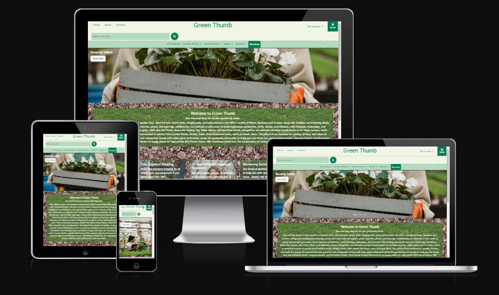

### A live demo to the website can be found [here](https://green-thumb1-5e1e889069e1.herokuapp.com/)

## UX 

This website is primarily crafted for gardening enthusiasts, landscapers, and those seeking professional gardening services. The key focus is to devise an online marketplace where users can easily purchase gardening essentials while professional gardeners can grow their audience base and potential customers.

- **Gardening Enthusiasts**: These users typically visit the platform for easy, convenient access to a wide array of gardening supplies. From the comfort of their home, they can sift through various products, read reviews, and make informed purchasing decisions. Additionally, they can also request quotes from registered professional gardeners for home gardening services.

- **Gardeners/Landscapers**: The website provides a platform for landscapers and gardeners to showcase their services, attract potential customers, and grow their business. They can manage their profile, interact with users, and receive feedback from customers efficiently.

This UX design emphasizes providing an intuitive, user-friendly experience. Its layout, functionality, and interaction are custom-tailored to the expectations and requirements of its target audience, thus making the gardening experience more enjoyable and efficient.

## User stories 

User stories can be viewed on this project's [kanban board](https://github.com/users/olliesharp5/projects/4) 

Please view the "Planning" section for more detail regarding how I implemented agile methodologies. 

### Strategy

The main objective while cultivating "Green Thumb" was to nurture a comprehensive platform that merges gardening enthusiasts and professional gardeners, facilitating a smooth, effortless e-commerce experience. We aimed for a strategy where gardening supplies and services are at the forefront, with the platform bolstering their effective presentation.

The underlying strategy comprised several crucial goals:

- **For Gardening Enthusiasts**: To provide a user-friendly platform with a diverse collection of gardening essentials replete with filters for easy search and discovery. It should also offer the convenience of interacting directly with professional gardeners for services at home.

- **For Gardeners/Landscapers**: To offer an open platform for them to gain visibility, interact with potential customers, and easily manage their profiles. 

- **For Potential Service Users**: The platform should offer clear information about the gardener, provide a line of communication for inquiries, and a simple quote request procedure.

### Business Model:

Business Model: Green Thumb operates under a combined B2C (Business-to-Consumer) and B2B (Business-to-Business) model. For B2C, it provides a marketplace for gardening enthusiasts to purchase gardening products. For B2B, it offers a platform for professional gardeners and landscapers to sell their services directly to consumers and businesses.

### Scope

**User Management**
- Registration and authentication for users who want to provide, purchase, or appreciate gardening services and supplies.
- Differentiation of user roles and permissions allowing for two levels of access: regular user and landscaping professional.
- Detailed profile creation and management, including dedicated options such as display name, location, profile image, and about information for the gardener role.

**Product and Service Interaction Features**
- Comprehensive product details including image, description, price, and customer reviews.
- Contact option between any user and the service provider creating an avenue for private conversations regarding the services offered.
- Support for interactive features like product reviews and quote requests.

**Product Management**
- Creation, editing, and deletion of product advertisements by site admins.
- Categorization of products based on type, price, and need, as selected by the user.
- Inbuilt search functionality to discover relevant products or services on the platform.

**User Interface and Experience**
- Clean, intuitive interface for easy navigation through the vast assortment of gardening supplies and services.
- A responsive design for access from any device, ensuring a superior user experience.
- Personalization options for user profiles, allowing a more immersive and individualized user experience.

**Responsiveness** 
- The website retains its aesthetic and functionality across screens of all sizes.
- The design caters to mobile devices primarily, ensuring smooth functionality on smaller screens.
- Fluid design elements and adaptable layouts adjust as per the device, from mobiles to desktop displays.
- The navigation menu collapses on smaller screens for an uncluttered interface. Card layouts, buttons, and forms also adjust accordingly for usability and readability.
- Its device compatibility not only enhances the user experience but also boosts the site's SEO performance.

**Website Sections:**
1. **_Base Header and Footer:_** A unified header and footer with functionalities varying based on login status and user role.
2. **_About:_** Overview of the company, mission, and values, providing an in-depth look at the product and its benefits.
3. **_Products:_** A comprehensive product catalog with category selectors in the navigation bar and filter options for a refined search experience.
4. **_Product Detail:_** Detailed view of individual products including descriptions, reviews, and purchase options. Interaction options vary based on user status.
5. **_Cart:_** View of the user's selected products with the ability to adjust quantities, remove items, and see a summary of the total cost.
6. **_Checkout:_** Step-by-step checkout process including shipping information, payment details, and order review.
7. **_Order Success:_** Confirmation page showing the order details and next steps after a successful purchase.
8. **_Services:_** A display of the services offered by our registered gardeners with descriptions of what each service includes. 
9. **_Gardener Profile:_** Detailed profile of a gardener including their bio, profile image, name, location and feedback they have received from other users.
10. **_Service Request:_** Form for users to request quotes for specific services.
11. **_Gardener Feedback:_** Section for users to leave feedback as reviews for gardeners they have interacted with.
12. **_Contact:_** Component for submitting customer service requests or general inquiries.
13. **_Profile:_** Personalized user profile with functionalities for editing profile details, managing passwords, and deleting the account.
14. **_Order History:_** Section within the user profile that displays a history of all past orders with details and status updates.
15. **_Wishlist:_** Section within the user profile where users can view their saved products they are interested in purchasing later.
16. **_Customer Service Requests:_** Section within the user profile for managing and viewing past customer service requests.
17. **_Gardener Requests:_** Section within the user profile for managing and viewing requests related to gardening services.
18. **_Register:_** Registration form allowing users to create an account with role selection and profile setup.
19. **_Login:_** Simple login form with validations to provide appropriate feedback to the user.
20. **_Logout:_** Functionality to log out with a confirmation prompt to ensure intentional actions by the user.
21. **_Add Product:_** Interface for authorized users to add new products to the catalog, including all necessary product details.

### Skeleton
The website is designed with the principles of both clarity and simplicity.

- **Header**: The topmost section includes a responsive navigation bar with links to different sections of the site: home, products, services, about, and contact. Depending on the user's role (visitor, regular user, service provider, or admin) and the state of login, different options are dynamically displayed in the header, such as profile, cart, and logout.

- **Body**: The body of the site changes dynamically based on the link clicked from the header. It can display the product catalog, detailed view of a product, profile view of a service provider, forms for customer service requests, user's profile page, or forms for registration and login.

  - **Products Page**: Displays a comprehensive product catalog with category selectors in the navigation bar and filter options for a refined search experience.

  - **Product Detail Page**: Provides a detailed view of individual products including descriptions, reviews, and purchase options. Interaction options vary based on user status.

  - **Cart Page**: Shows the user's selected products with the ability to adjust quantities, remove items, and see a summary of the total cost.

  - **Checkout Page**: Guides the user through the checkout process including shipping information, payment details, and order review.

  - **Order Success Page**: Displays a confirmation message and order details after a successful purchase.

  - **Services Page**: Paginated display of service providers registered on the site with each card displaying profile image, name, and location.

    - ***Gardener Profile Page***: Detailed profile of a gardener including their bio, profile picture and feedback from other users.

    - ***Service Request Page***: Form for users to request specific services, with options varying based on user status.

    - ***Gardener Feedback Page***: Section for users to leave feedback and reviews for gardeners they have interacted with.

  - **Help Section**: Includes a form through which users can submit their customer service requests or inquiries.

  - **Profile Section**: Personalized user profile where users can view and edit their profile details, manage passwords, view order history, manage wishlist, and delete their account. Service providers can manage their service requests and feedback.

  - **Register and Login Pages**: Forms for creating a new account and logging into an existing account, with validations to provide appropriate user feedback.

- **Footer**: The lowermost static part of the site displaying copyright information, social media links, and an email input field for users to sign up for the newsletter.

The website employs a hierarchical tree structure where the home page serves as the root. The different sections of the site can be accessed from the top-level navigation in the header. The flows from top to bottom are intuitive and provide a seamless user experience.

### Wireframes 

The wireframes were designed using Balsamiq software.

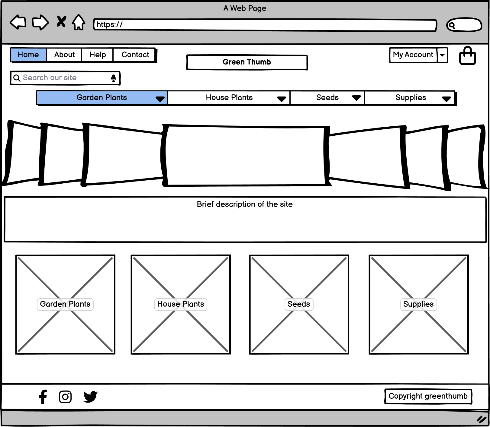 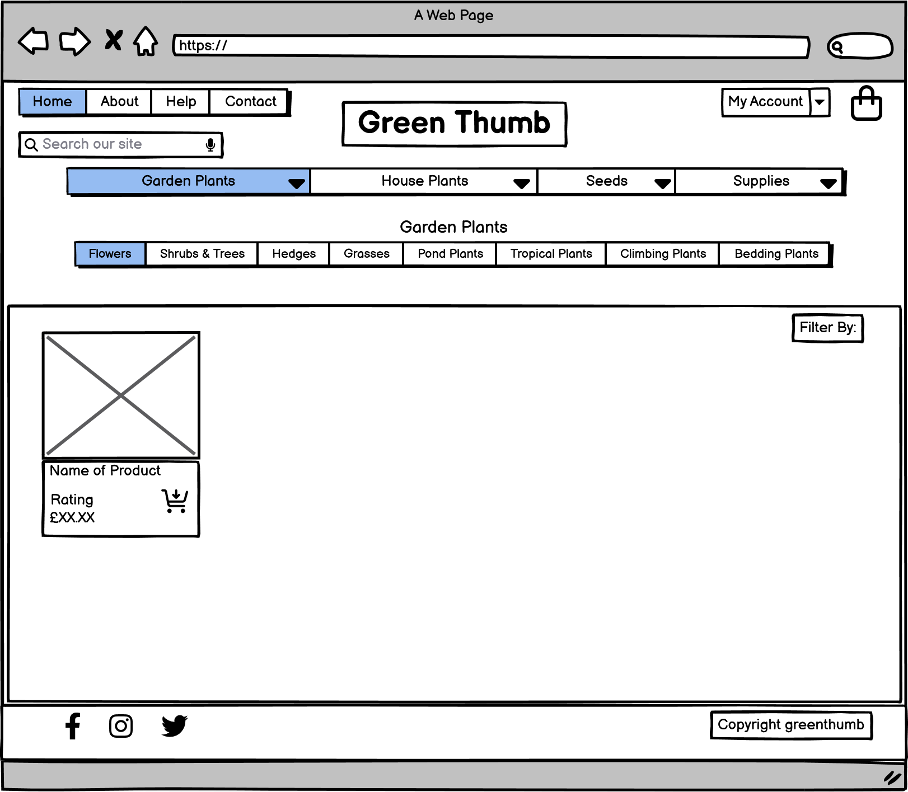 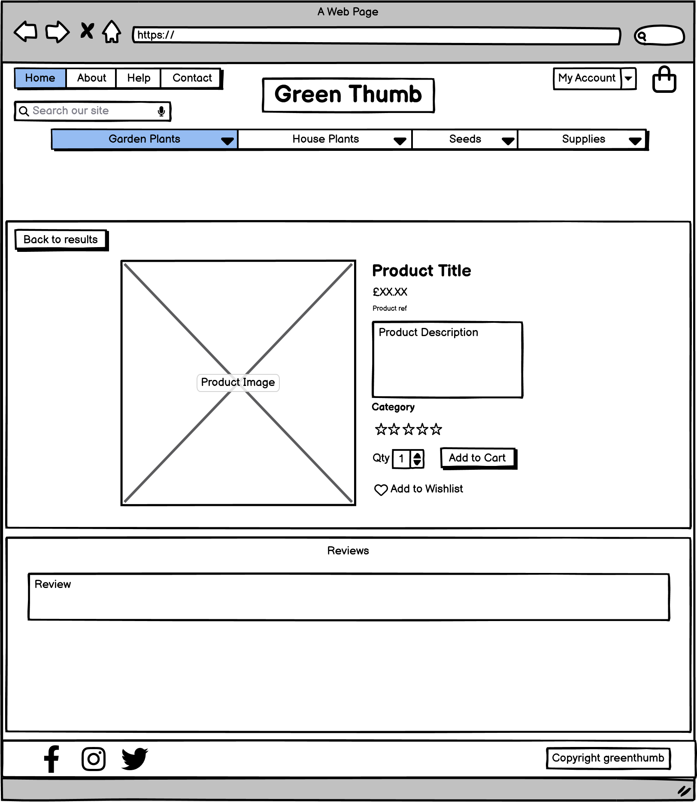
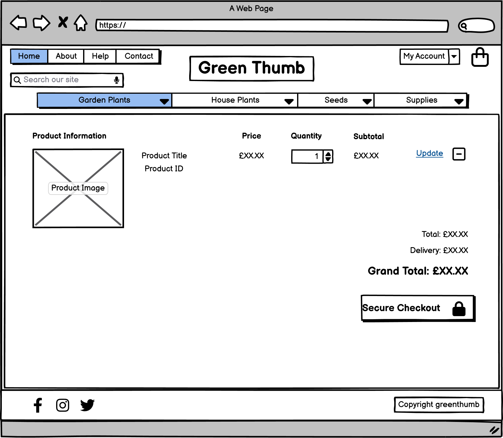 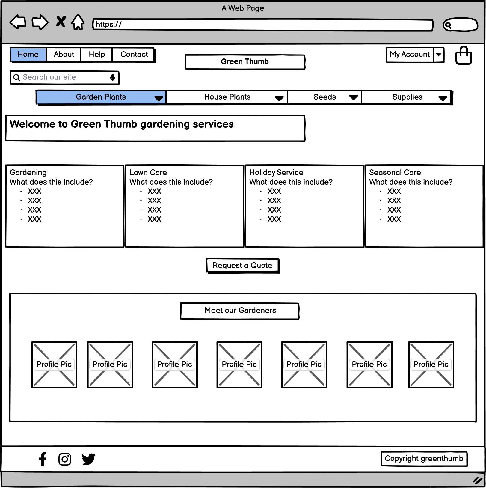

### Planning

I meticulously designed this project using the agile methodology, really showcasing the benefits of a dynamic, iterative development process. 

Applying the MoSCoW prioritization method, I classified these user stories within the Issues tab as follows:

- Must Have: Essential features that are guaranteed for delivery, comprising up to 70% of the stories.
- Should Have: Important features that add significant value but are not critical, making up about 10% of the stories.
- Could Have: Features with a minor impact that can be omitted if necessary, also representing around 10% of the stories.
- Won't Have: Features that are not a priority for the current iteration and will not be included, also representing around 10%.

This method ensures that the most vital elements of the project are prioritized and delivered first, while maintaining flexibility for additional features based on their value and impact.

### Sprints

#### To note: The best way to view these sprints is by configuring them to Group By: "Milestone". Each task in the sprint has been assigned a milestone with subtasks linked to it. 

In line with agile methodologies, this project has been structured into a series of three sprints, each designed to deliver incremental value and functionality. By breaking down the project into manageable sprints, it ensures continuous improvement, flexibility, and a focus on delivering functional components at each stage. Here’s an overview of how I implemented these sprints:

#### Sprint 1: Foundation and Core Features

**Objective:**
Establish the foundational elements of the project, including basic configuration, user authentication, and initial functionality for product management and the cart system.

**Tasks Completed:**
- Setup and Basic Configuration
- User Authentication and Profile Management
- Product and Wishlist Management
- Cart Functionality

[Detailed Sprint 1 Page](https://github.com/users/olliesharp5/projects/5)

#### Sprint 2: Checkout and User Enhancements

**Objective:**
Enhance the user experience with robust checkout processes, order management, and additional functionalities for user profiles and feedback systems.

**Tasks Completed:**
- Checkout and Order Management
- User Profile Enhancements
- Services, Gardener Profile and Feedback
- About, contact form and gardener form

[Detailed Sprint 2 Page](https://github.com/users/olliesharp5/projects/6)

#### Sprint 3: Refinements and Deployment

**Objective:**
Focus on refining the user experience, fixing bugs, and preparing the project for deployment. This includes documentation updates and final feature enhancements.

**Tasks Completed:**
- Feature Enhancements and Bug Fixes
- Documentation and Deployment Preparation

[Detailed Sprint 3 Page](https://github.com/users/olliesharp5/projects/7)

### Agile Practices Followed

- **Incremental Delivery:** Each sprint delivered functional increments of the project, allowing for continuous feedback and adjustments.
- **Collaboration and Communication:** Regular mentor meetings and updates ensured that we were aligned and any issues were addressed promptly.
- **Flexibility and Adaptability:** The project was flexible to changes in requirements and priorities, ensuring that the most valuable features were delivered first.
- **Continuous Improvement:** Each sprint included a review phase with my mentor to reflect on what worked well and what could be improved in the next sprint.

### Surface

The visual aesthetics of the site incorporate a color palette that complements the detailed images of gardening supplies and services, set against a backdrop of gardening-themed images to provide an immersive atmosphere for user engagement.

The strategic selection of the color palette aimed to mirror the natural and fresh ambiance of a garden, while ensuring excellent contrast and accessibility. The predominant colors across the site are #007B55, a deep green echoing the vibrancy of nature and symbolizing growth; #B2DBBF, a light mint green, adding a touch of freshness; and #F1F5E6, a cream white that provides a neutral backdrop allowing the products and services to stand out.

| Hex | RGB |
| -------------- | ----------------- |
| #004731 | (0, 71, 49) |
| #B2DBBF | (178, 219, 191) |
| #F1F5E6 | (241, 245, 230) |

The font family used across the site is 'Trebuchet MS', 'Lucida Sans Unicode', 'Lucida Grande', 'Lucida Sans', Arial, sans-serif. This typography was chosen for its readability and modern look, aligning perfectly with the overall aesthetic of an online gardening supply and service marketplace.

The gardening themed images and opaque coloured cards employed for text display across the site enhance the visual appeal and readability, enriching the overall user experience.

### Models

This section outlines the various data models used in the application, organized by their respective apps. Each model includes its fields, field types, and validation rules. Understanding the relationships and the schema helps in managing data efficiently and ensuring data integrity across the system.

#### Checkout App

The Checkout App handles the ordering process, including capturing order details and individual line items.

##### Order

The Order model captures details about each order placed by users. It includes information such as user profile, contact details, and order costs.

| Field Name       | Field Type              | Validation/Choices                                   |
|------------------|-------------------------|-----------------------------------------------------|
| order_number     | UUIDField               | primary_key=True, default=uuid.uuid4, editable=False|
| user_profile     | ForeignKey(UserProfile) | on_delete=models.SET_NULL, null=True, blank=True, related_name='orders' |
| full_name        | CharField               | max_length=50, null=False, blank=False              |
| email            | EmailField              | max_length=254, null=False, blank=False             |
| phone_number     | CharField               | max_length=20, null=False, blank=False              |
| country          | CountryField            | blank_label='Country *', null=False, blank=False    |
| postcode         | CharField               | max_length=20, null=True, blank=True                |
| town_or_city     | CharField               | max_length=40, null=False, blank=False              |
| street_address1  | CharField               | max_length=80, null=False, blank=False              |
| street_address2  | CharField               | max_length=80, null=True, blank=True                |
| county           | CharField               | max_length=80, null=True, blank=True                |
| date             | DateTimeField           | auto_now_add=True                                   |
| delivery_cost    | DecimalField            | max_digits=6, decimal_places=2, null=False, default=0 |
| order_total      | DecimalField            | max_digits=10, decimal_places=2, null=False, default=0 |
| grand_total      | DecimalField            | max_digits=10, decimal_places=2, null=False, default=0 |
| original_cart    | TextField               | null=False, blank=False, default=''                 |
| stripe_pid       | CharField               | max_length=254, null=False, blank=False, default='' |

##### OrderLineItem

The OrderLineItem model captures individual items within an order, linking to products and tracking quantities and costs.

| Field Name       | Field Type              | Validation/Choices                                   |
|------------------|-------------------------|-----------------------------------------------------|
| order            | ForeignKey(Order)       | null=False, blank=False, on_delete=models.CASCADE, related_name='lineitems' |
| product          | ForeignKey(Product)     | null=False, blank=False, on_delete=models.CASCADE    |
| product_size     | CharField               | max_length=2, null=True, blank=True                 |
| quantity         | PositiveIntegerField    | null=False, blank=False, default=0                  |
| lineitem_total   | DecimalField            | max_digits=6, decimal_places=2, null=False, blank=False, editable=False |

#### Contact App

The Contact App manages user customer service inquiries.

##### ContactRequest

The ContactRequest model captures messages sent by users, including optional file uploads.

| Field Name       | Field Type              | Validation/Choices                                   |
|------------------|-------------------------|-----------------------------------------------------|
| full_name        | CharField               | max_length=200                                      |
| email            | EmailField              |                                                     |
| subject          | CharField               | max_length=200, choices=SUBJECT_CHOICES             |
| message          | TextField               |                                                     |
| file_upload      | FileField               | upload_to='uploads/', null=True, blank=True         |
| created_at       | DateTimeField           | auto_now_add=True                                   |
| status           | CharField               | max_length=2, choices=STATUS_CHOICES, default='O'   |

#### Products App

The Products App handles the categorisation and details of products available for purchase.

##### Category

The Category model organizes products into hierarchical categories.

| Field Name       | Field Type              | Validation/Choices                                   |
|------------------|-------------------------|-----------------------------------------------------|
| name             | CharField               | max_length=200                                      |
| slug             | SlugField               | max_length=200, unique=True, blank=True             |
| parent           | ForeignKey('self')      | on_delete=models.CASCADE, null=True, blank=True     |

##### Product

The Product model stores details about individual products, including descriptions, prices, and optional images.

| Field Name       | Field Type              | Validation/Choices                                   |
|------------------|-------------------------|-----------------------------------------------------|
| sku              | CharField               | max_length=254, null=True, blank=True               |
| name             | CharField               | max_length=254                                      |
| description      | TextField               |                                                     |
| has_size         | BooleanField            | default=False, null=True, blank=True                |
| price            | DecimalField            | max_digits=6, decimal_places=2                      |
| rating           | DecimalField            | max_digits=2, decimal_places=1, null=True, blank=True |
| image            | ImageField              | null=True, blank=True                               |
| category         | ForeignKey(Category)    | on_delete=models.CASCADE                            |
| date_added       | DateTimeField           | auto_now_add=True                                   |

##### Review

The Review model captures user reviews for products, including ratings and textual feedback.

| Field Name       | Field Type              | Validation/Choices                                   |
|------------------|-------------------------|-----------------------------------------------------|
| product          | ForeignKey(Product)     | on_delete=models.CASCADE, related_name='reviews'    |
| user             | ForeignKey(User)        | on_delete=models.CASCADE                            |
| title            | CharField               | max_length=200, null=True                           |
| rating           | DecimalField            | max_digits=2, decimal_places=1, validators=[MinValueValidator(0), MaxValueValidator(5)] |
| text             | TextField               |                                                     |
| date_added       | DateTimeField           | auto_now_add=True                                   |

#### Profiles App

The Profiles App manages user profiles and their preferences.

##### UserProfile

The UserProfile model stores user-specific information and preferences.

| Field Name             | Field Type              | Validation/Choices                                   |
|------------------------|-------------------------|-----------------------------------------------------|
| user                   | OneToOneField(User)     | on_delete=models.CASCADE                            |
| role                   | CharField               | max_length=2, choices=USER_ROLES, default='RU'      |
| display_name           | CharField               | max_length=100, null=True, blank=True, unique=True  |
| location               | TextField               |                                                     |
| profile_image          | ImageField              | null=True, blank=True                               |
| about                  | TextField               |                                                     |
| default_phone_number   | CharField               | max_length=20, null=True, blank=True                |
| default_street_address1| CharField               | max_length=80, null=True, blank=True                |
| default_street_address2| CharField               | max_length=80, null=True, blank=True                |
| default_town_or_city   | CharField               | max_length=40, null=True, blank=True                |
| default_county         | CharField               | max_length=80, null=True, blank=True                |
| default_postcode       | CharField               | max_length=20, null=True, blank=True                |
| default_country        | CountryField            | blank_label='Country', null=True, blank=True        |

##### Wishlist

The Wishlist model allows users to save products they are interested in for future reference.

| Field Name       | Field Type              | Validation/Choices                                   |
|------------------|-------------------------|-----------------------------------------------------|
| user             | ForeignKey(UserProfile) | on_delete=models.CASCADE                            |
| products         | ManyToManyField(Product)|                                                     |

#### Services App

The Services App manages service offerings and requests for gardening services quote enquiries.

##### Service

The Service model defines the types of services available.

| Field Name       | Field Type              | Validation/Choices                                   |
|------------------|-------------------------|-----------------------------------------------------|
| name             | CharField               | max_length=200, choices=SERVICE_CHOICES             |

##### ServiceRequest

The ServiceRequest model captures details about requests for services, including user information and required dates.

| Field Name       | Field Type              | Validation/Choices                                   |
|------------------|-------------------------|-----------------------------------------------------|
| full_name        | CharField               | max_length=200                                      |
| email            | EmailField              |                                                     |
| services         | ManyToManyField(Service)|                                                     |
| message          | TextField               | null=True, blank=True                               |
| file_upload      | FileField               | upload_to='uploads/', null=True, blank=True         |
| date_required    | DateField               | help_text='Date when the service is required'       |
| created_at       | DateTimeField           | auto_now_add=True                                   |
| status           | CharField               | max_length=2, choices=STATUS_CHOICES, default='O'   |
| user             | ForeignKey(User)        | on_delete=models.CASCADE, null=True                 |

##### GardenerFeedback

The GardenerFeedback model captures feedback and ratings for gardeners.

| Field Name       | Field Type              | Validation/Choices                                   |
|------------------|-------------------------|-----------------------------------------------------|
| gardener         | ForeignKey(UserProfile) | on_delete=models.CASCADE, limit_choices_to={'role': 'GR'} |
| user             | ForeignKey(UserProfile) | on_delete=models.CASCADE                            |
| title            | CharField               | max_length=200                                      |
| message          | TextField               |                                                     |
| rating           | DecimalField            | max_digits=2, decimal_places=1, validators=[MinValueValidator(0), MaxValueValidator(5)] |
| created_at       | DateTimeField           | auto_now_add=True                                   |

### Data Schema Overview 

The data schema is designed to maintain relational integrity and ensure efficient data management. The following are the primary relationships between models:

#### User Profiles:

UserProfile is linked to User via a one-to-one relationship.
Order and Wishlist models reference UserProfile to associate orders and wishlists with specific users.

#### Orders and Products:

The Order model is linked to OrderLineItem through a foreign key, capturing multiple items per order.
OrderLineItem references the Product model to identify the specific products ordered.

#### Product Categorization:

Product is linked to Category to facilitate product categorization.
Review is linked to Product to allow users to leave feedback on specific products.

#### Service Requests:

ServiceRequest references Service and User to capture user requests for specific services.
GardenerFeedback links feedback to gardeners via UserProfile.

#### Contact Management:

ContactRequest captures user inquiries, allowing optional file uploads and status tracking.
This relational structure ensures that data integrity is maintained, enabling robust and efficient data management across the application.

## Technologies 

The website is designed using following technologies: HTML, CSS, Bootstrap, Javascript, Django, MarkDown, ElephantSQL, Chrome Dev Tools, Stripe, Amazon AWS, Favicon

### Libraries

* asgiref==3.8.1: ASGI (Asynchronous Server Gateway Interface) reference implementation, which provides utilities for working with ASGI servers.
* boto3==1.34.103: The Amazon Web Services (AWS) SDK for Python, which allows Python developers to write software that makes use of Amazon services like S3 and EC2.
* botocore==1.34.103: The low-level, core functionality of Boto3, providing the foundational interface for interacting with AWS services.
* dj-database-url==0.5.0: Allows the use of the DATABASE_URL environment variable to configure the database in Django applications.
* gunicorn==20.1.0: A Python WSGI HTTP server for UNIX, used to serve your Django application.
* jmespath==1.0.1: A query language for JSON, used by Boto3 and other libraries to parse and extract data from JSON documents.
* pillow==10.3.0: The Python Imaging Library (PIL), which adds image processing capabilities to your Python interpreter.
* psycopg2==2.9.9: PostgreSQL database adapter for Python, allowing your Django application to interact with PostgreSQL databases.
* s3transfer==0.10.1: A library for managing Amazon S3 transfers, used internally by Boto3.
* sqlparse==0.5.0: A non-validating SQL parser for Python, used for splitting, formatting, and validating SQL statements.
* stripe==9.5.0: Python bindings for the Stripe API, enabling integration with Stripe's payment processing services.
* [Font Awesome](https://fontawesome.com/v4.7.0/) - Font Awesome icons were used throughout the web-site.

### Frameworks & Extensions

* [Django](https://www.djangoproject.com/) – Django is a high-level Python Web framework that encourages rapid development and clean, pragmatic design.
* [Bootstrap5](https://getbootstrap.com/) – Bootstrap5 is a web framework that focuses on simplifying the development of informative web pages.
* django-allauth==0.62.1: Integrated set of Django applications addressing authentication, registration, account management.
* django-countries==7.6.1: Provides a country field for Django models with a sensible selection of country choices.
* django-crispy-forms==2.1: The best way to have Django DRY forms. Build programmatic reusable layouts out of components, having full control of the rendered HTML.
* crispy-bootstrap5==2024.2: Bootstrap5 template pack for django-crispy-forms.
* django-mathfilters==1.0.0: Provides a set of simple math filters for Django templates.
* django-storages==1.14.3: A collection of custom storage backends for Django.

### Others

* [GitHub](https://github.com/) - GitHub is a global company that provides hosting for software development version control using Git.
* [Gitpod](https://gitpod.io/workspaces/) - One-click ready-to-code development environments for GitHub.
* [Heroku](https://dashboard.heroku.com/) - Heroku is a cloud platform that lets companies build, deliver, monitor and scale apps.

## Features 

### Existing Features

* Base Header and Footer
   - **Header:** The top navigation bar includes links to home, about, contact, and (for superusers) an add product option. The site title is centered, and a "My Account" dropdown on the right includes options like my profile, order history, wishlist, customer service requests, gardening requests, logout (if logged in), and register/login (if not logged in). 
   - **Search Bar:** Below the top navigation is a search bar for searching the site.
   - **Main Navigation:** Below the search row are dropdowns for product categories, allowing users to navigate specific categories.
   - **Footer:** The footer includes social links, copyright information, and a subscribe-to-newsletter input field.
   - Both header and footer are fully responsive.
  
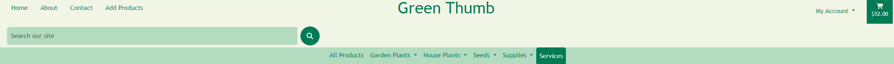
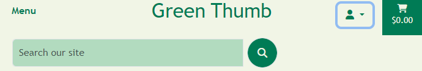
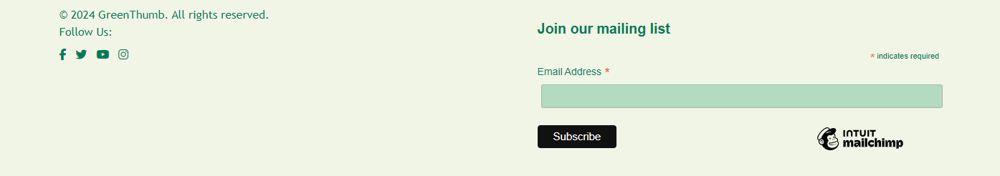

* Home
   - Landing page with a carousel of images showcasing recently added, best-selling, and highest-rated products.
   - A short introduction to Green Thumb.
   - Three feature cards highlighting shipping, the 30-day guarantee, and gardening services offered.
  
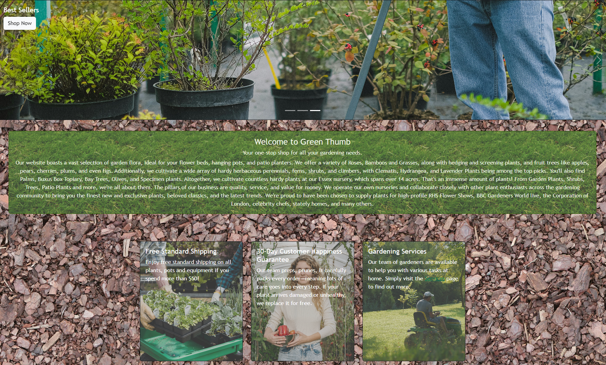

* About
   - Contains the mission statement, images, history, reputation, certifications, and licenses of the company.
  

* Products
   - Displays a themed background image depending on the category.
   - Card display of products including image, name, rating, price, and a quick add-to-basket button with a size selector if applicable. The quick add defaults to a quantity of one.
  
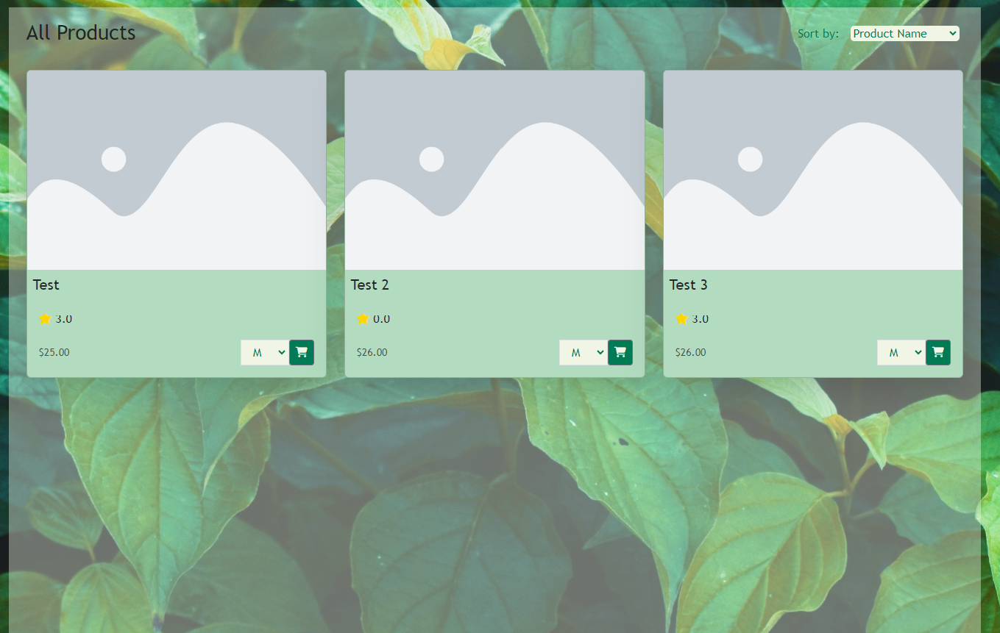

* Product Detail
   - Detailed product view with larger images, title, price, description, category, rating, size selector (if required), quantity selector, add-to-cart button, add/remove from wishlist button.
   - Reviews section where reviews are displayed in a card format with author, rating, title, message, and date/time created. Product ratings are based on these reviews.
   - Users can post one review per product, edit, and delete their reviews.
   - Only logged-in users can leave reviews or add to the wishlist.
   - Superusers can edit and delete products from this page.
  

* Cart
   - If the cart is empty, it advises the user and links back to the products page.
   - Displays each cart item in a row with product name, price, quantity, total. Users can edit quantities and delete items.
   - Cart total, delivery, and grand total values are displayed at the bottom with buttons to continue shopping or proceed to checkout.

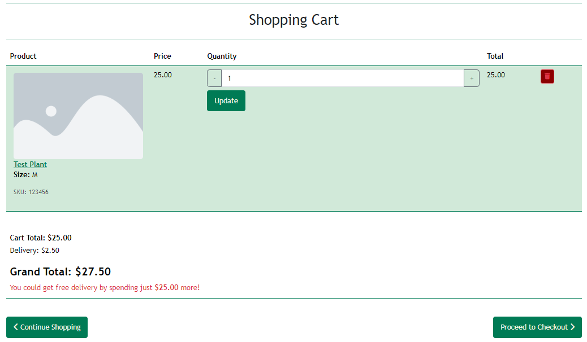

* Checkout
   - A form for customer information: name, email, phone number, country, delivery address details.
   - Logged-in users can save this info to their profile with a checkbox.
   - A prompt for non-logged-in users to log in or register to save information.
   - Payment information field imported via Stripe.
   - Order summary on the right.
   - Buttons to adjust the cart (returns to cart page) and complete the order (validates form and initiates payment).

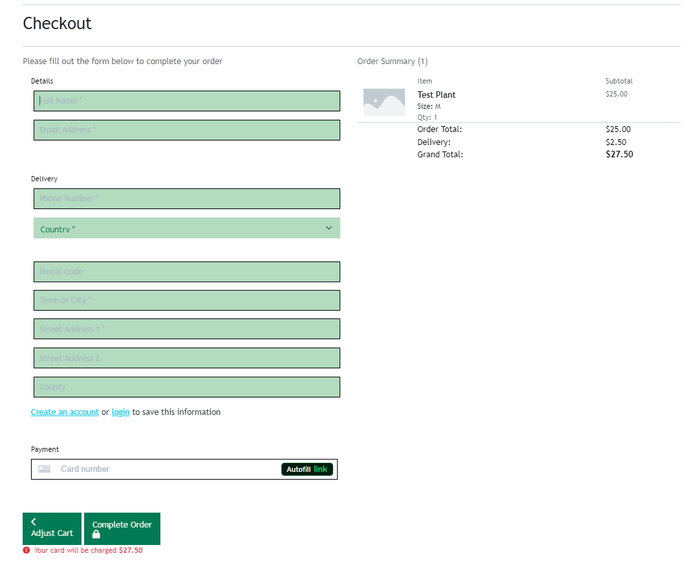

* Order Success
   - Displays an order summary: order number, order date, line items, delivery information, personal details.
   - A button to continue shopping that returns to the products page.
  
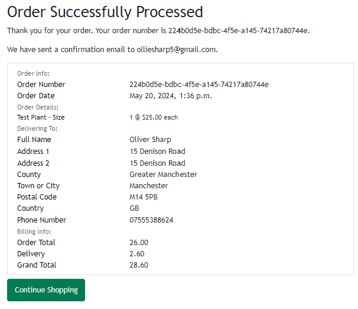

* Services
   - Title welcoming users to the services section.
   - Four columns outlining service categories and their details.
   - Button to request a quote, opening the service request page.
   - Display of registered gardeners with name and profile picture, linking to their profile pages.
  
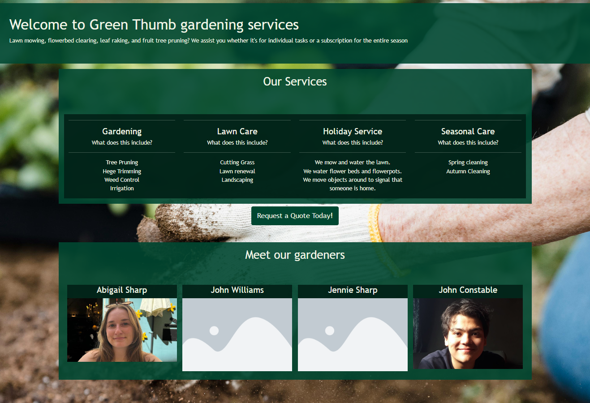

* Gardener Profile 
    - Centered card with profile image, name, location, about section, and average rating.
    - Feedback cards from users beneath, containing username, title, message, and rating.
    - Average rating is calculated from user-submitted ratings.
    - Button to leave gardener feedback.
  
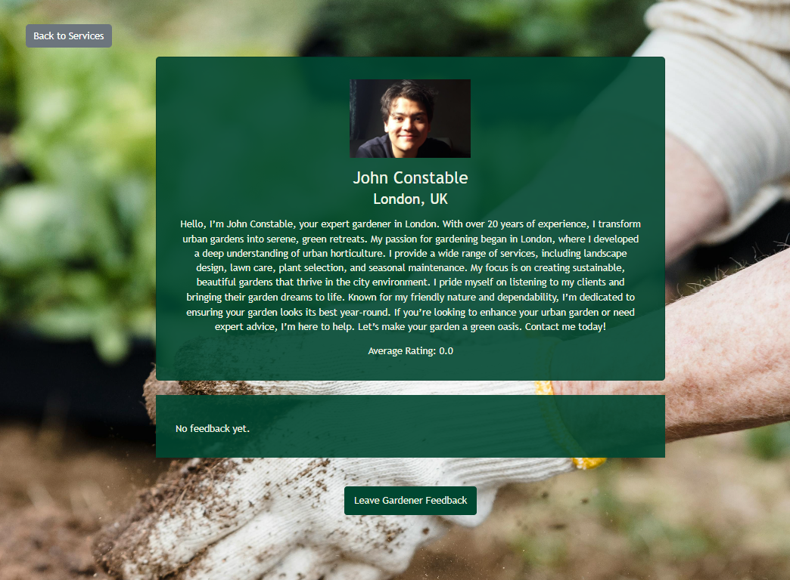

* Service Request 
    - Form for requesting quotes for gardening services, accessible by guests and registered users.
    - Fields: full name, email, services required (checkbox), message, file attachment, date required (with calendar selector).
    - Form validation on required fields.
  
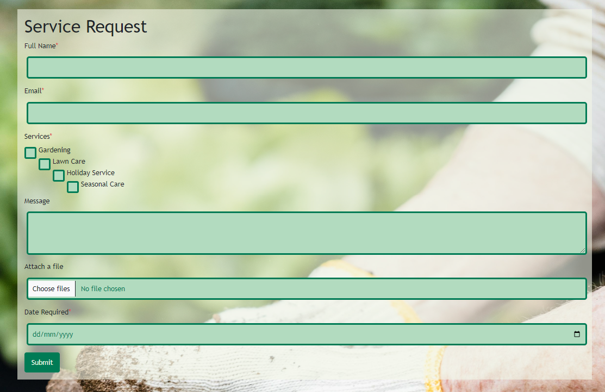

* Gardener Feedback
    - Form for submitting feedback for registered gardeners.
    - Fields: dropdown to select the gardener, title, message, rating (dropdown).
  
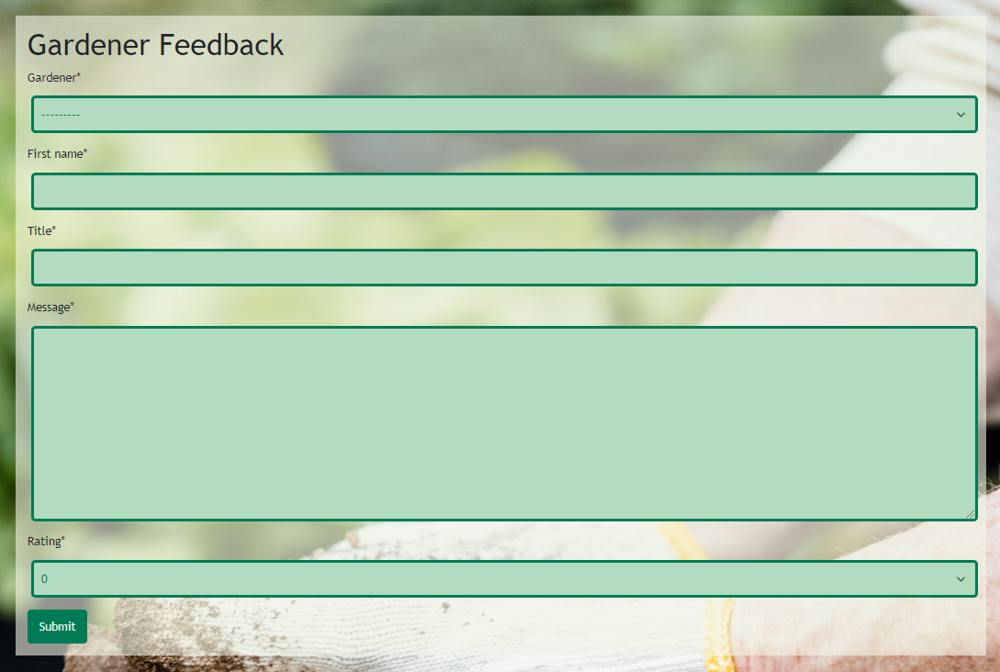

* Contact
    - Form for submitting customer service requests.
    - Fields: full name, email, subject (dropdown with common categories), message, file attachment.
    - Form validation on required fields.
  
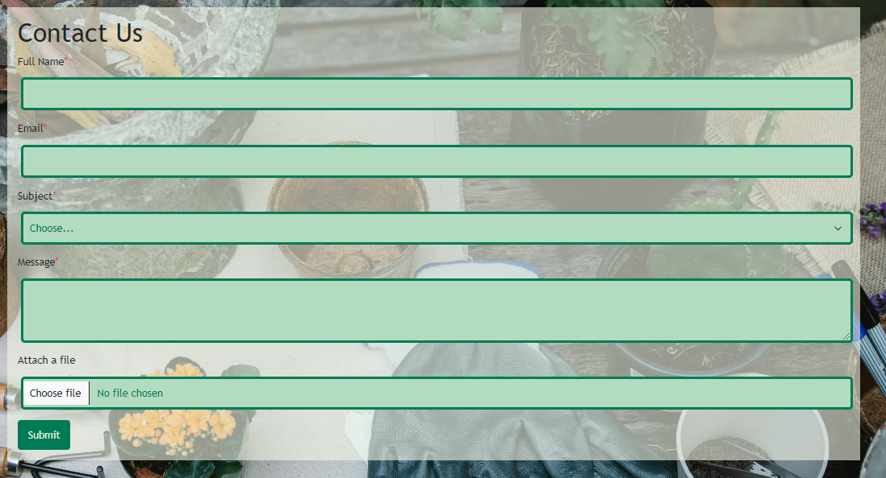

* Profile
    - Displays saved profile information.
    - Personal information on the left (name, email).
    - Gardener profile section (if applicable) beneath, displaying profile picture, location, and about section.
    - Default delivery information on the right, saved during checkout.
    - Edit icons to update information via modal, and a delete profile button.
  
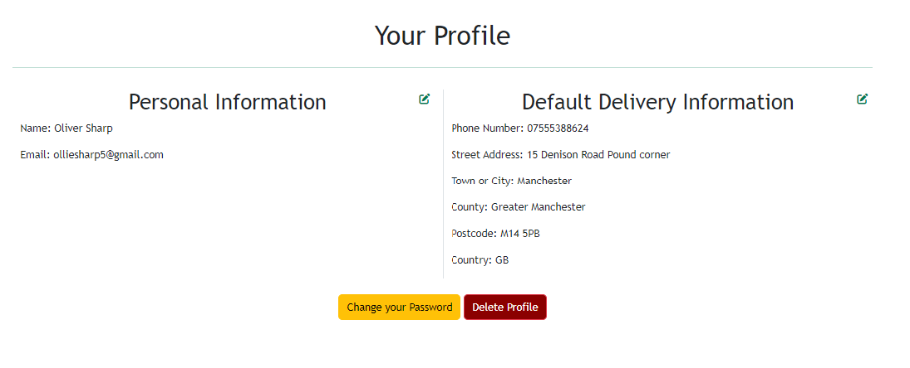

* Order History
    - Table showing previous orders with order number (linking to order success page), order date, line items, and order total.

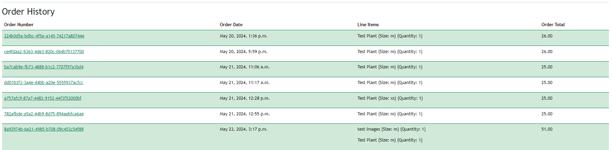

* Wishlist
    - Table of wishlist items with product image, name (linking to product detail page), description, and price.
    - Option to delete items from the wishlist.

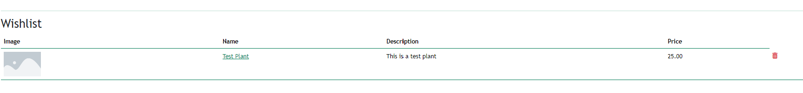

* Customer Service Requests
    - Table displaying a history of customer service requests with full name, email, subject, message, status, and days since submission.
    - Status updated by the customer service team to show progress.

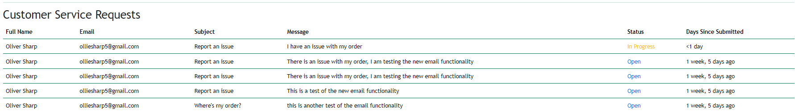

* Gardener Requests
    - Table displaying a history of gardening service requests with full name, email, services, message, date required, status, and days since submission.
    - Status updated by the customer service team to show progress.

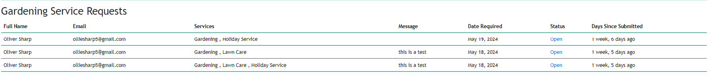

* Register
    - Registration form with fields for username, email address, password, and confirm password.
    - Checkbox for gardeners; additional fields for display name, location, profile image, and about section appear if checked.

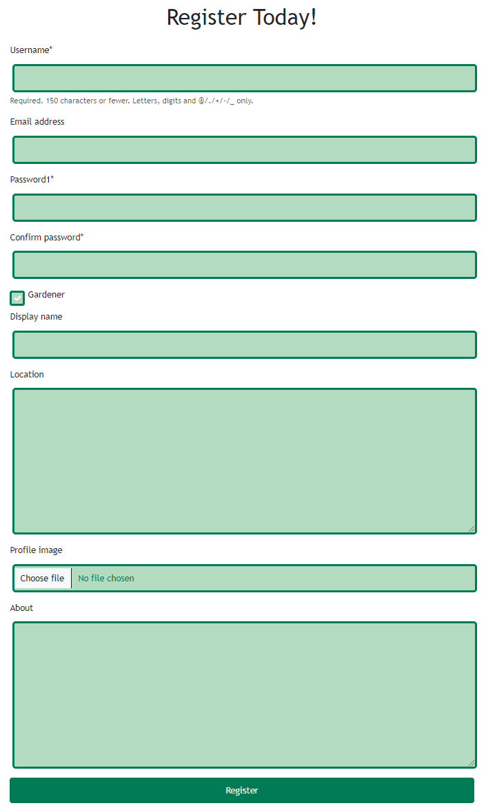

* Login
    - Sign-in page with fields for login and password, and a checkbox to remember the user.

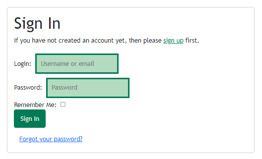

* Logout 
    - Prompt confirming the user's intent to log out, with a button to complete the action.

* Add Product
    - Available only to superusers.
    - Form with fields for SKU, name, description, checkbox for size options, price, image, and category (dropdown selector).

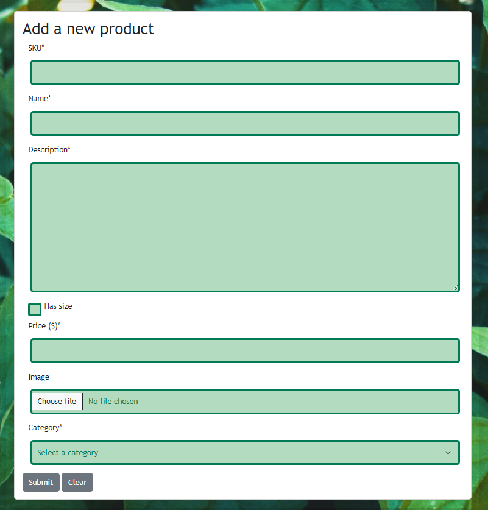

* 404 Page
   - Presents when a user navigates to a page that doesn't exist 
   - Contains links back to the home page and contact page 

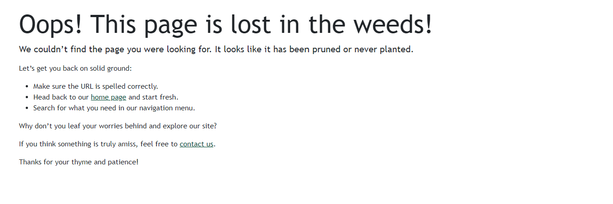

### Features Left to Implement

In the future, I would like to add the following features to enhance user experience and functionality:

1. **Subscription Service:**
   - Introduce a subscription model allowing users to receive regular shipments of gardening products or curated selections of plants and seeds.
   - Offer tiered subscription plans with different levels of service and benefits.

2. **Community Forum:**
   - Create a community forum where users can discuss gardening tips, share their experiences, and ask questions.
   - Include categories for different types of plants, gardening techniques, and regional gardening advice.

3. **Gardening Tutorials and Workshops:**
   - Add a section for video tutorials and articles on various gardening topics, ranging from beginner to advanced levels.
   - Implement an online workshop registration system where users can sign up for virtual or in-person gardening workshops hosted by expert gardeners.

4. **Plant Care Reminders:**
   - Develop a feature where users can receive notifications and reminders for plant care tasks such as watering, fertilizing, and pruning based on the plants they own.

5. **Enhanced Search and Filtering:**
   - Improve the search functionality with advanced filtering options, such as plant type, sunlight requirements, water needs, and growth habits.
   - Include a plant identification tool that allows users to upload a photo of a plant to identify it and receive care instructions.

6. **User-Generated Content:**
   - Allow users to upload and share photos of their gardens, plants, and DIY gardening projects.
   - Implement a rating and comment system for user-generated content to foster community interaction and feedback.

7. **Loyalty and Rewards Program:**
   - Introduce a loyalty program where users can earn points for purchases, reviews, and participating in community activities, which can be redeemed for discounts or special offers.

8. **Integration with Smart Gardening Devices:**
   - Integrate with smart gardening devices and sensors to provide users with real-time data and insights about their garden's health.
   - Develop a dashboard to monitor soil moisture, temperature, and light levels, helping users make informed decisions about their plant care.

9. **Expanded Service Offerings:**
   - Add new categories of gardening services, such as landscape design consultation, pest control services, and seasonal maintenance packages.
   - Enable booking and payment for these services directly through the website.

10. **Mobile App:**
    - Develop a mobile app to provide users with easy access to all website features on the go.
    - Include features like plant care reminders, a plant identification tool, and the ability to purchase products and book services from the app.

## Marketing Strategies 

### Social Media Marketing
I created a dedicated Facebook page for the brand to enhance our social media presence and engage with our audience. This page serves as a platform to share updates, promotions, and interact directly with customers, fostering a community around the brand.

### Email Marketing
To streamline the email marketing efforts and manage our mailing list efficiently, I integrated Mailchimp into my website. This allows visitors to easily subscribe to our newsletter and ensures that we can send targeted email campaigns to our subscribers, keeping them informed about new products, promotions, and company news.

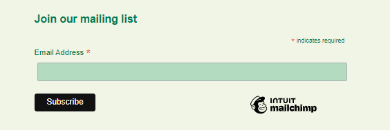

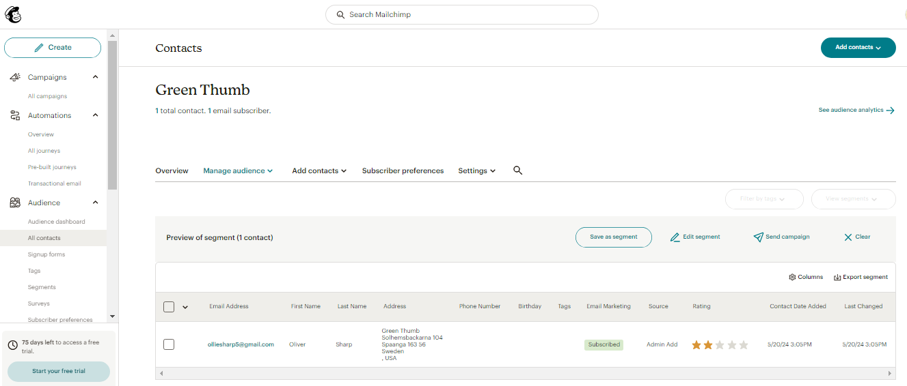

### SEO Best Practices
Implementing SEO strategies including optimized images, meta tags, a semantic HTML structure, and a well-organized sitemap to improve search engine visibility and drive organic traffic.

### Content Marketing
Regularly updating the site with high-quality, relevant content such as gardening tips, tutorials, and user-generated content to attract and retain users.

## SEO 

### Implementing robots.txt
I implemented a `robots.txt` file to control and optimize the way search engines crawl and index the website. This file helps in directing search engines to important pages while preventing them from indexing irrelevant or sensitive parts of the site, thus improving our site's SEO performance.

### Implementing sitemap.xml
The website includes a `sitemap.xml` file, which provides search engines with a structured list of all the pages on my site. This helps search engines discover and index our content more effectively, ensuring that all relevant pages are included in search results and improving the site's visibility.

### Meta Tags
I added relevant meta tags to my website's HTML to provide search engines with essential information about the different pages. These tags include the title, description, and keywords, which help improve the click-through rate from search engine results pages by making our listings more attractive and informative to users.

### Semantic Structure
My website follows a semantic structure, using HTML5 elements such as `<header>`, `<article>`, `<section>`, and `<footer>`. This approach improves accessibility, enhances the user experience, and helps search engines understand the content and structure of our pages better, contributing to better SEO performance.

### Other SEO Best Practices
In addition to the above, we have implemented other SEO best practices, including:
- **Optimized Images**: I use appropriately sized and compressed images to improve page load times.
- **Mobile-Friendly Design**: My site is responsive and mobile-friendly, providing a good user experience across all devices.
- **Internal Linking**: I have a robust internal linking structure to help users and search engines navigate the site more efficiently.
- **High-Quality Content**: I regularly update our site with high-quality, relevant content that provides value to our users and helps attract organic traffic.

## Stripe Webhook Integration 

My implementation ensures all Stripe webhooks are successfully handled. Here's a brief overview:

### Webhook Endpoint (webhooks.py)
- Endpoint: /webhook/
- Setup: Retrieves and verifies webhook signature using Stripe's secret key.
- Handler Mapping: Routes different webhook events (e.g., payment success/failure) to specific handler functions.

### Webhook Handler (webhook_handler.py)
#### Handler Class: StripeWH_Handler
#### Functions:
 - handle_event(): Handles unknown events.
 - handle_payment_intent_succeeded(): Processes successful payments, creates orders, and sends confirmation emails.
 - handle_payment_intent_payment_failed(): Logs failed payment intents.

This setup ensures reliable handling and processing of Stripe events.

## Testing 

* I tested the site, and it works in different web browsers: Chrome, Firefox, and Microsoft Edge.
* On mobile devices, I tested the my site on a Samsung Galaxy S21 Ultra with the Samsung browser and an iPhone 13 with the Safari browser.
* I confirmed that the site is responsive and functions on different screen sizes using the devtools device toolbar.

### Django Testing 

* I have implemented 18 individual tests on multiple views in the "Accounts", "Cart", "Checkout" and "Contact" apps. The tests can be found in the tests.py files of my Django project. To run the tests, input "python manage.py test" into your IDE console.  

### Manual Testing

| **Website Section** | **Functionality** | **Test Case ID** | **Test Scenario** | **Test Steps** | **Expected Outcome** |
|---------------------|-------------------|------------------|-------------------| --------------|---------------------|
| **_Base Header and Footer_** | Clickable social links | #1 | Validate clicking on social links | Click each social link in the header and footer | The associated social page opens up in a new tab |
| **_Base Header and Footer_** | My Account dropdown | #2 | Test My Account dropdown | Click on the "My Account" dropdown and select each option | The corresponding page opens or action is performed correctly |
| **_Base Header and Footer_** | Navigation links | #3 | Test navigation links | Click on each link in the header navigation bar | The corresponding page loads correctly |
| **_Base Header and Footer_** | Responsive design | #4 | Test responsiveness | Resize the browser window to small and large sizes | Header and footer adjust and display correctly |
| **_Search Bar_** | Search functionality | #5 | Test search functionality | Enter a keyword in the search bar and press enter | Search results matching the keyword are displayed |
| **_Home_** | Carousel functionality | #6 | Test carousel | Navigate through the carousel images | Carousel transitions smoothly and displays correct images |
| **_Register_** | User registration | #7 | Test for registration | Input all required fields and press the register button | Successful registration with a profile creation |
| **_Login_** | User login | #8 | Test for login | Input correct user credentials and press login | Successful user login |
| **_Logout_** | User logout | #9 | Test for logout | Press logout button | Successful user logout with a confirmation prompt |
| **_Products_** | Category navigation | #10 | Test product category navigation | Click on each category in the main navigation dropdown | The corresponding product category page loads correctly |
| **_Product Detail_** | Add to cart | #11 | Test add to cart functionality | Select size (if applicable), quantity, and press add to cart | Product is added to the cart with correct details |
| **_Product Detail_** | Review submission | #12 | Test review submission | Write a review and submit | Review is saved and displayed correctly |
| **_Product Detail_** | Wishlist functionality | #13 | Test add/remove from wishlist | Add and remove a product from the wishlist | Wishlist updates correctly with added/removed product |
| **_Cart_** | Cart operations | #14 | Test cart operations | Change quantity, delete items, proceed to checkout | Cart updates correctly and checkout process starts |
| **_Checkout_** | Form validation | #15 | Test form validation | Fill the form with invalid data and try to proceed | Form displays appropriate validation errors |
| **_Order Success_** | Order summary display | #16 | Test order summary display | Complete an order and view the order success page | Correct order details are displayed |
| **_Services_** | Request a quote | #17 | Test request a quote | Fill out the service request form and submit | Quote request is submitted successfully |
| **_Profile_** | Update profile details | #18 | Test updating profile details | Update personal information and save changes | Profile details are updated successfully |
| **_Profile_** | Delete profile | #19 | Test deleting profile | Follow profile deletion process | Successful profile deletion with confirmation |
| **_Wishlist_** | Wishlist operations | #20 | Test wishlist operations | Add multiple items to wishlist and remove them | Wishlist updates correctly with added/removed items |

### Validator Testing

#### HTML
No errors were found when passing through the official W3C validator.

#### CSS
No errors were found when passing through the official (Jigsaw) validator.

#### JSHint
No errors were found when passing through the official (JSHint) validator.

| HTML Validation Screenshots | CSS Validation Screenshot | JavaScript Validation Screenshot |
|:---------------------------:|:-------------------------:|:---------------------------------:|
| 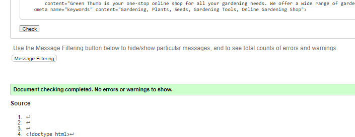 | 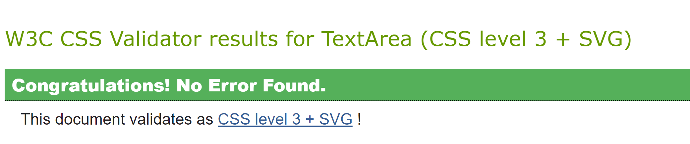 | 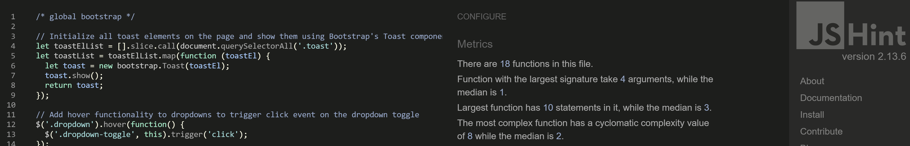 |
| 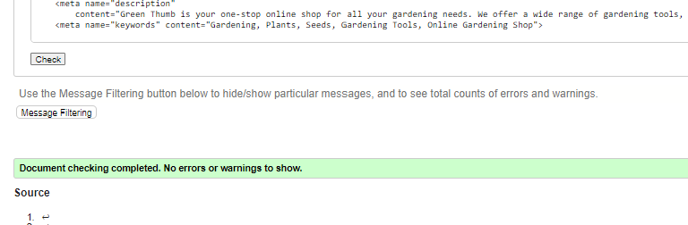 |                           |  |
| 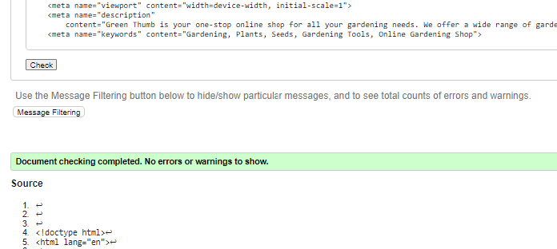 |                           |  |
| 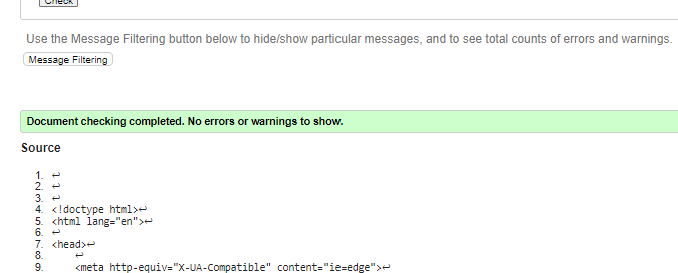 |                           |  |
| 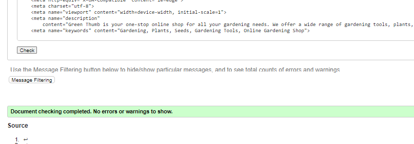 |                           |                                   |
| 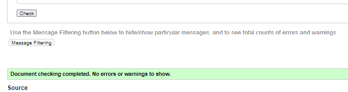 |                           |                                   |
| 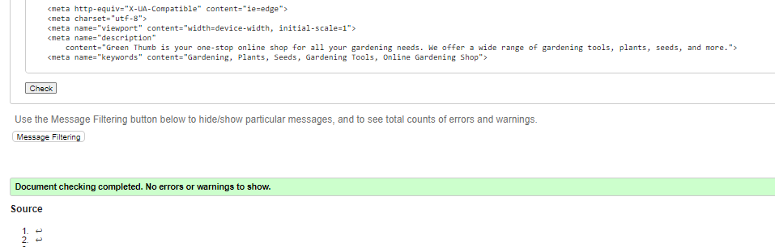 |                           |                                   |

#### WebAim Contrast checker 
No errors were found when passing through the contrast validator.

#### Fixed Bugs

* When attempting to sort products by rating, an error occurred due to a type mismatch between DecimalField (used for ratings) and IntegerField (used for handling null ratings).
To resolve this, the Coalesce function was used to treat null ratings as 0, ensuring all ratings are treated as DecimalField. The output_field parameter was specified to maintain consistent field types.

*  The "Back to results" button on the product detail page initially used the standard go back function (window.history.back()). However, this approach did not account for scenarios where users took actions on the product detail page that triggered it to reload (e.g., adding a product to the cart or adding to wishlist). In such cases, clicking the "Back to results" button would take users back to the previous instance of the same product detail page, rather than the search results page they intended to return to.
To address this issue, I implemented a solution using session storage. By storing the URL of the search results page when a user clicks on a product detail link, it ensures that the "Back to results" button can always navigate the user back to the correct page.

* When a user selects the "Edit Review" button, two sets of forms for editing and deleting reviews are displayed in the modal. This leads to confusion and potential errors, as both forms target different review IDs. The modal forms were updated to dynamically populate with the correct review details when the "Edit Review" or "Delete Review" buttons are clicked. This ensures only the relevant form is displayed and populated correctly.

* The <select> element in the form was not displaying the downward chevron to indicate it is a dropdown field. This issue occurred despite using Bootstrap 5. To resolve this issue, custom CSS styles were added to the <select> element to enforce the appearance of the dropdown indicator. 

* I implemented a calculate_rating method in the Product model to calculate the average product rating based on user reviews. However, simply adding this method did not automatically update the product's rating when reviews were added, updated, or deleted. As a result, the product's rating remained unchanged despite changes in the reviews.
To ensure that the product's rating is updated whenever a review is added, updated, or deleted, I implemented a Django signal in signals.py. This signal triggers the calculate_rating method and updates the product's rating accordingly.

* I faced an issue where the registration form only created regular users, regardless of which fields were completed. I needed a solution to create different types of users (regular users and gardeners) based on the fields filled out in a single registration form.To address this issue, I enhanced the registration view and form handling logic to differentiate between regular users and gardeners. I used a single form for user registration and an additional form for gardener-specific details. Based on the form inputs, I created the appropriate user type.

**Registration View:**
I used RegistrationForm to handle basic user details and GardenerForm to handle gardener-specific details.
The view checks the gardener field in the RegistrationForm to determine the type of user to create.
If the gardener checkbox is checked and the GardenerForm is valid, a gardener profile is created. Otherwise, a regular user profile is created.
After creating the appropriate user profile, the user is logged in and redirected to the home page.

**UserProfile Model:**
The UserProfile model includes a role field to distinguish between regular users and gardeners.
The model's save method includes validation to ensure gardeners have the necessary profile details.

**Forms:**
RegistrationForm handles basic user details, including a checkbox for identifying gardeners.
GardenerForm includes additional fields specific to gardeners, such as display name, location, and about section.

**JavaScript for Dynamic Form Handling:**
I used JavaScript to dynamically show or hide the gardener-specific fields based on the state of the gardener checkbox. When the gardener checkbox is checked, the gardener fields are displayed and marked as required. When unchecked, these fields are hidden and not required.

* When users attempted to register as gardeners and upload a profile image, the image was not being saved to the AWS S3 bucket. This issue was caused by incorrect handling of the image file in the form submission process. To fix this issue I added the enctype="multipart/form-data" attribute to the form tag in the register.html template to ensure that files can be uploaded. Additionally I ensured that the request.FILES data is correctly passed to the GardenerForm in the view handling the registration.

* Gardener profile pictures were not being displayed on the frontend. Instead, a placeholder image was shown even when a profile image was uploaded. The template was checking for the wrong field name when determining whether to display the profile image or the placeholder image. To fix this I corrected the conditional logic in the services.html and gardener_profile.html templates to check for the correct field (profile_image) when displaying the gardener profile pictures.

* There was a critical bug in the user registration process where the application would attempt to save a gardener profile even when the form was invalid. This caused a ValueError with the message "Gardener must have a display name, location, and about section." The error was occurring because the form's validation logic was not correctly identifying missing or invalid fields, allowing the gardener_profile.save() method to be called with incomplete data.
To resolve this issue, the following steps were taken:

**Updated Form Field Names and Validation:**
The RegistrationForm fields for passwords were corrected to use password1 and password2 to match the names used in the form's clean method.
The GardenerForm fields (display_name, location, about) were explicitly marked as required to ensure proper validation.

**Enhanced View Logic:**
The register view was updated to ensure that the gardener profile is only saved if both the user_form and gardener_form are valid.
Added transaction management to ensure atomicity of the save operations, preventing partial saves in case of errors.

**Improved Testing:**
Test cases were updated to correctly simulate invalid form submissions and verify that errors are properly handled.
Added debug statements to the view to trace form validation status and errors, ensuring that invalid forms are not processed for saving.

#### Unfixed Bugs

* The Tooltip element on product detail page dissapears too soon after the cursor leaves its space. I have tried adding padding and margins to the tooltip container but it seems to make no significant difference. 

## Deployment 

### Version Control

The following git commands were used throughout development to push code to the remote repo:

- git add - This command was used to add the file(s) to the staging area before they are committed.

- git commit -m “commit message” - This command was used to commit changes to the local repository queue ready for the final step.

- git push - This command was used to push all committed code to the remote repository on github.

### Heroku Deployment

- Heroku provides a platform for hosting web applications.
- The deployed site will update automatically upon new commits to the main branch.

### Performance

**Lighthouse reports:** 

* Home Page
- Third party code from Stripe negitavley affected my Performance score here. In the future I would look futher into solutions to this to rduce unwarranted stress on my site. 
- Third party cookies from Stripe affected my Best Practices score as support for third-party cookies will be removed in a future version of Chrome.

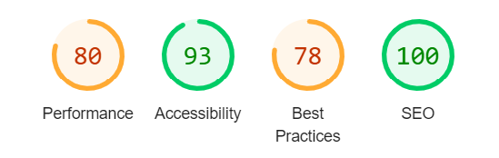

* Products Page 
- Third party cookies from Stripe affected my Best Practices score as support for third-party cookies will be removed in a future version of Chrome.

* Product Detail Page 
- Third party cookies from Stripe affected my Best Practices score as support for third-party cookies will be removed in a future version of Chrome.

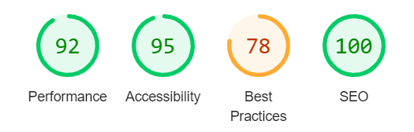

* Services Page
- Third party cookies from Stripe affected my Best Practices score as support for third-party cookies will be removed in a future version of Chrome.

* Login/Logout/Register Pages
- Third party cookies from Stripe affected my Best Practices score as support for third-party cookies will be removed in a future version of Chrome.

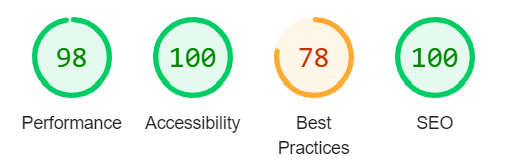

* Profile/Order History/Wishlist/Service Requets/Gardening Requests Pages
- Third party cookies from Stripe affected my Best Practices score as support for third-party cookies will be removed in a future version of Chrome.

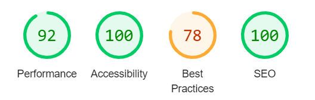

* Contact/Add Products/Service Request/Gardener Feedback forms 
- Third party cookies from Stripe affected my Best Practices score as support for third-party cookies will be removed in a future version of Chrome.

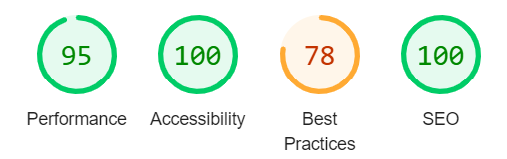

## Credits 

### Content
* Credit for stripe integration taken from Stripe web documentation and the Boutique-Ado walkthrough project from Code Institute 
* Integration of webhook handlers for the stripe integration credited from the Boutique-Ado walkthrough project from Code Institute
* Credit to my mentor Medale Oluwafemi for directing me on how to structure my UserProfile models and develop my UI to be easier to navigate for users 

### Media

* The icon used for the favicon is from favicon.io
* The icons used accross the site were taken from Font Awesome
* Credit provided for background images: https://www.pexels.com/  
* Credit for product images and product_detail content: https://www.gardeningexpress.co.uk/ 
